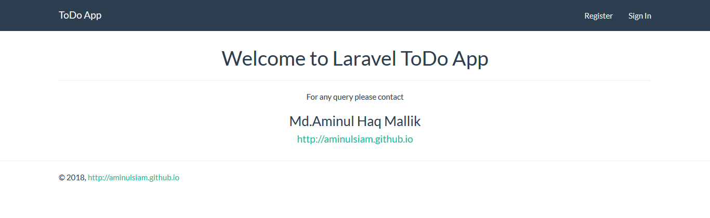

<h2>Laravel ToDo App</h2>

This is a simple ToDo app with multiple user support.

This is built on Laravel Framework 5.1. This was built for demonstrate purpose.

<h3>Installation</h3>

Clone the repository-

git clone
 <a href="">https://github.com/milon521/laravel-todo.git</a>

Then cd into the folder with this command-

cd laravel-todo
Then do a composer install

<h3>composer install</h3>
Then create a environment file using this command-

cp .env.example .env
Then edit .env file with appropriate credential for your database server. Just edit these two parameter(DB_USERNAME, DB_PASSWORD).

Then create a database named todos and then do a database migration using this command-

php artisan migrate
Then change permission of storage folder using thins command-

(sudo) chmod 777 -R storage
At last generate application key, which will be used for password hashing, session and cookie encryption etc.

php artisan key:generate
<h3>Run server</h3>
Run server using this command-

php artisan serve
Then go to http://localhost:8000 from your browser and see the app.

Ask a question?
If you have any query please contact at <a href="">milon521@gmail.com</a>

Screenshot
